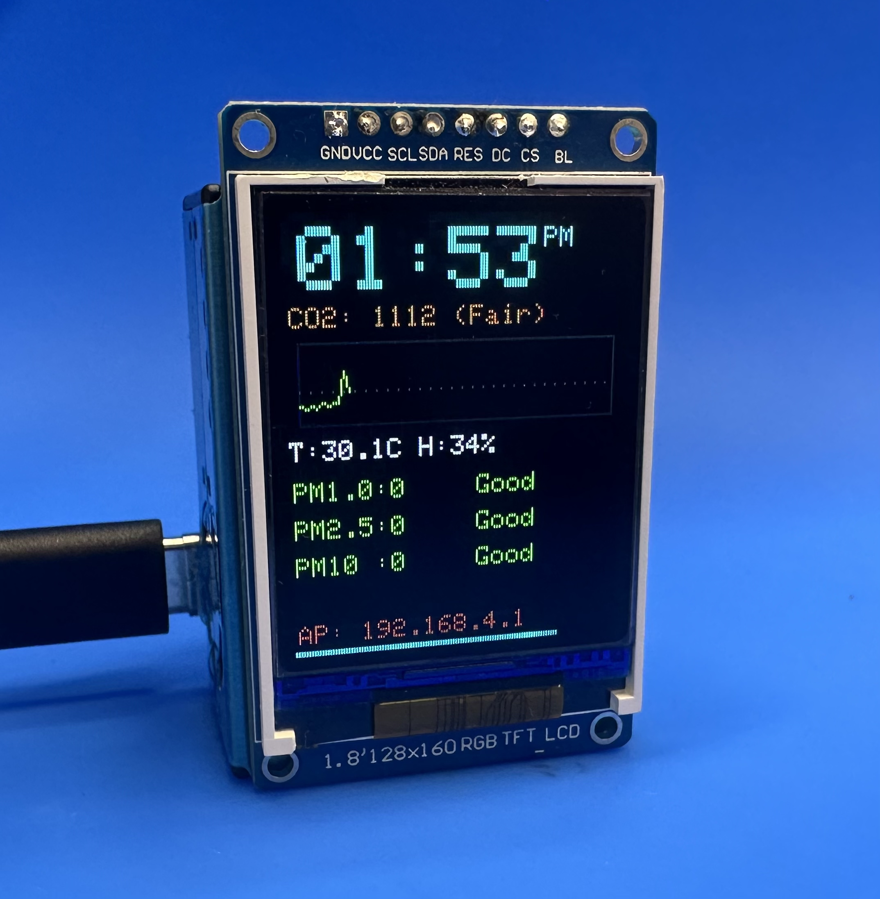

# Air Quality Monitor 

A professional-grade **Air Quality Monitor** based on the **ESP32-S3**, featuring high-precision sensors, a built-in web-manager for configuration, and MQTT integration for Smart Home systems.

---

## 🚀 Features
- **Dual-Sensor Monitoring**:
  - **CO₂, Temperature, and Humidity**: via Sensirion **SCD30** (NDIR technology).
  - **PM1.0, PM2.5, PM10**: via Plantower **PMS5003** (Laser scattering).

- **Advanced Display UI (ST7735)**:
  - **Real-time CO₂ Graph: 30-minute visual history with auto-scaling.
  - **Persistent Clock: Smart RTC logic that keeps showing time even if Wi-Fi connection is lost (after initial sync).
  - **Smooth Progress Bar: Visual indicator of data refresh cycles.
  - **System Diagnostics: Detailed splash screen showing sensor and network health on boot.

- **Web-Based Settings Manager**:
  - **On-the-fly Config: Change Wi-Fi, MQTT details, GMT offset, and DST settings via browser.
  - **Built-in WiFi Scanner: Easily find and connect to networks through the web UI.

- **MQTT Integration: Stream real-time data to Home Assistant, OpenHAB, or Node-RED in JSON format with status indicators (M:OK / M:ERR)**.

- **Smart Connectivity**:
  - **Multi-WiFi Support: Remembers and automatically connects to up to 5 saved networks.
  - **Fallback AP Mode: Automatically enters Access Point mode if no saved Wi-Fi is available.

- **Reliability**:
  - **Non-Volatile Memory: All settings are securely saved in ESP32 Flash (Preferences).
  - **Internal RTC Persistence: Enhanced time-keeping stability without constant internet polling.
  



---

## 🛠 Hardware Components

| Component | Purpose | Interface |
| :--- | :--- | :--- |
| **ESP32-S3** | Main Controller | - |
| **Sensirion SCD30** | CO₂, Temp, Humidity | I2C (Pins 12, 13) |
| **Plantower PMS5003** | Dust Particles (PM) | UART (Pins 10, 11) |
| **ST7735 1.8" LCD** | Visual Dashboard | SPI (Pins 1-6) |

---

## 📊 Interpretation Levels

The device uses universal color-coding for both the Web UI and the TFT Display:

| Level | CO₂ (ppm) | PM2.5 (µg/m³) | Color |
| :--- | :--- | :--- | :--- |
| **Good** | < 800 | 0 - 12 | 🟢 Green |
| **Fair** | 800 - 1200 | 13 - 35 | 🟡 Orange |
| **Poor** | 1200 - 2000 | 36 - 55 | 🔴 Red |
| **Bad** | > 2000 | > 55 | 🟤 Dark Red |

---

## ⚙️ Configuration & Setup

1. **Upload**: Flash the provided `air_quality_monitor.ino` sketch to your ESP32-S3.
2. **First Boot**: The device will create a Wi-Fi network: `AIR-SCAN-CONFIG` (Pass: `12345678`).
3. **Web Portal**: Connect your phone/PC to this network and go to `http://192.168.4.1`.
4. **Settings**: 
   - Scan for your home Wi-Fi.
   - Enter MQTT Broker details (if used).
   - Click **Save & Restart**.
5. **Operation**: After reboot, the device will show its new local IP on the screen. Use this IP to view the real-time web dashboard.

---

## 📡 MQTT Payload Format

The device publishes a JSON string to the topic `air/status` every 10 seconds:

```json
{
  "co2": 650,
  "pm1": 5,
  "pm25": 12,
  "pm10": 15,
  "t": 24.5,
  "h": 45
}
```
## 🔌 Wiring Diagram


##  📝 License
This project is open-source and available under the MIT License. Feel free to modify and improve!
