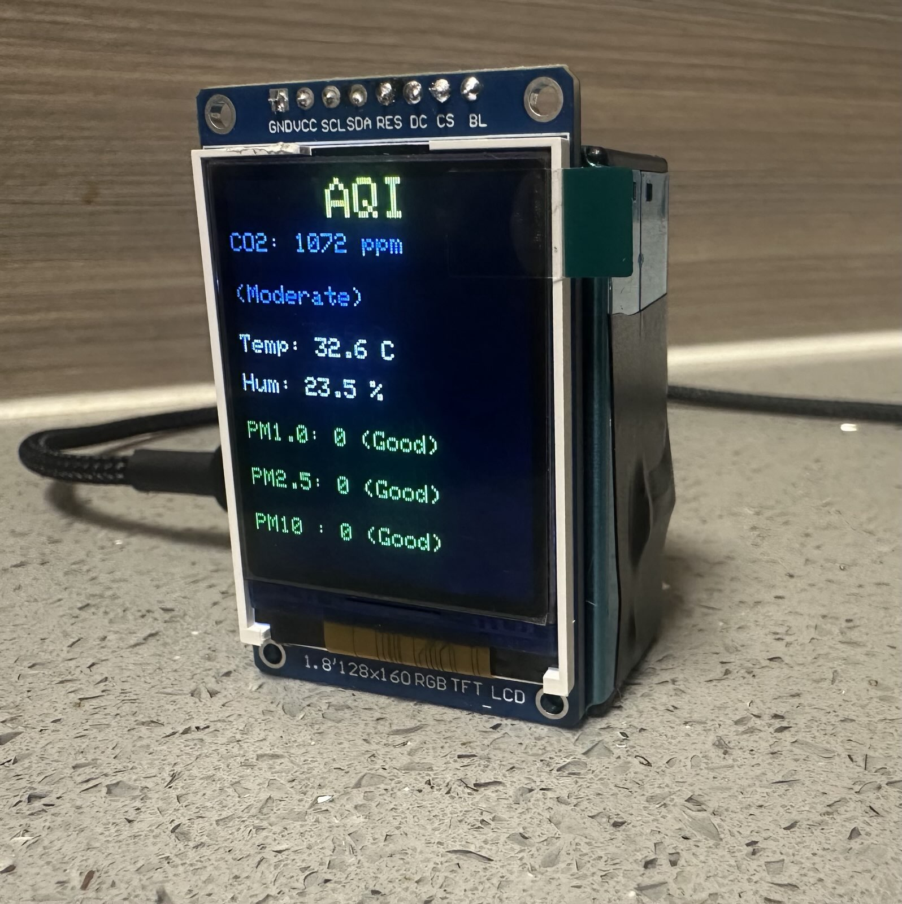
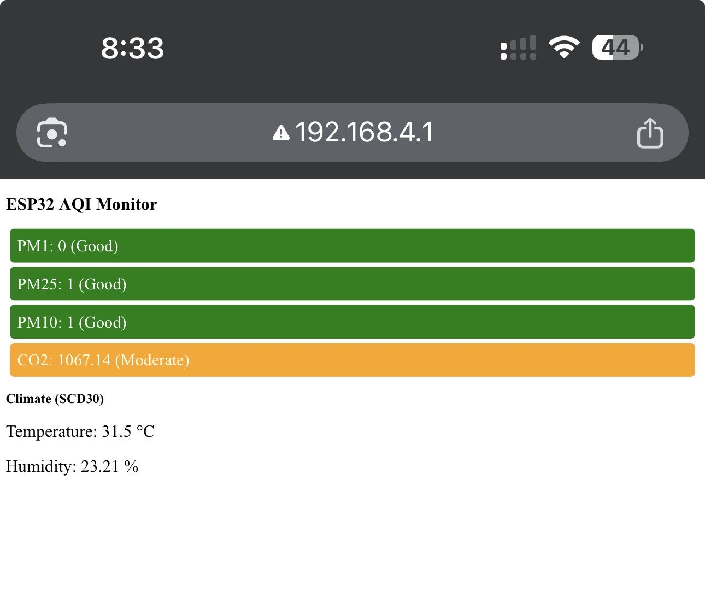
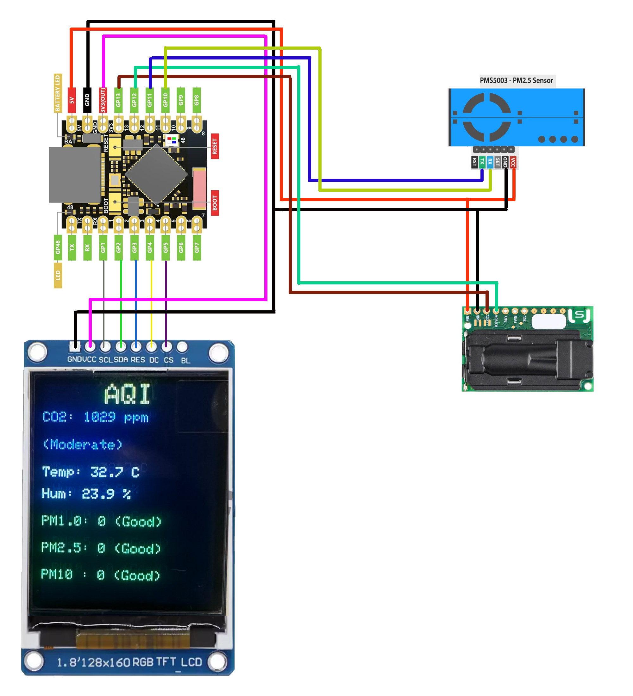

# Air Quality Monitor 

A compact and wireless **Air Quality Monitor** using **ESP32**, capable of measuring:

- **CO₂, Temperature, and Humidity** via **SCD30 sensor**
- **PM1.0, PM2.5, PM10** via **PMS5003 sensor**

The project features:

- A **web-based interface** with real-time air quality display and color-coded levels.
- A **SPI display (ST7735)** showing all sensor data with color-coded levels to match the web interface.
- Wi-Fi **Access Point mode** for direct connection to the ESP32.
- Fully **open-source Arduino code** ready to upload to ESP32 boards.

---

## Features

- Real-time CO₂, temperature, humidity, and particulate matter monitoring.
- Color-coded levels for easy interpretation:
  - **Good** – Green
  - **Moderate** – Orange
  - **Poor/Unhealthy** – Red
  - **Hazardous** – Magenta
- Display mirrors the web interface with sensor readings and color coding.
- Easy setup with minimal wiring.

---

## Hardware

- **ESP32-S3**
- **Sensirion SCD30** (CO₂, Temperature, Humidity)
- **Plantower PMS5003** (PM1.0, PM2.5, PM10)
- **ST7735 SPI Display**
- Power supply and connecting wires as per schematic

> See the included `diagram.png` for the wiring and connections.

---

## Software

- Developed in **Arduino IDE**
- Uses libraries:
  - `WiFi.h`
  - `WebServer.h`
  - `Wire.h`
  - `Adafruit_SCD30.h`
  - `SPI.h`, `Adafruit_GFX.h`, `Adafruit_ST7735.h`

---

## Usage

1. Upload the code to your ESP32 board.
2. Connect all sensors and display as shown in the schematic.
3. Power on the ESP32.
4. Connect to the Wi-Fi network `ESP32-AQI` (password: `12345678`).
5. Open a browser and go to `192.168.4.1` to see the web interface.
6. Read data on the web or directly on the SPI display.

---

## Wiring Diagram

Include your diagram image in the project folder as `diagram.png`. It should show all connections for sensors and the display.

 

---

## License

This project is **open-source** and free to use under the MIT License.

